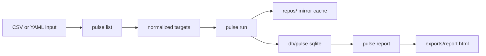
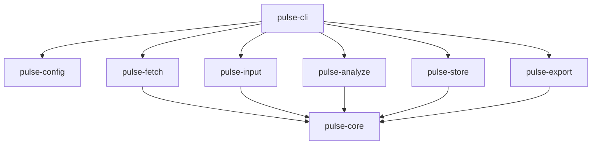

# Pipeline Overview

This document explains `pulse` as a system instead of as a set of commands.

If you are new to the project, read this after [../../README.md](../../README.md) and [../user-manual.md](../user-manual.md).

## 1. The Core Idea

`pulse` is built around a durable pipeline:

```text
explicit inputs -> fetch -> analyze -> persist -> report
```

The project is deliberately opinionated about this flow:

- repository inputs must be explicit
- expensive work should be reusable
- state should survive interruption
- reports should be generated from persisted state

This is why the state directory is not an implementation detail. It is part of the product model.

## 2. The Main Stages

### Stage A: Intake

Inputs come from:

- CSV
- YAML
- in the future, provider-backed discovery

Responsibilities:

- parse repository definitions
- normalize repository identities
- merge optional metadata such as teams or owner levels
- resolve focus and report configuration

Main crates involved:

- `pulse-config`
- `pulse-input`
- `pulse-core`

### Stage B: Fetch

Repositories are cloned or updated into managed local Git mirrors.

Responsibilities:

- create missing local mirrors
- fetch updates for known repositories
- record fetched revision and fetch timestamp
- make reruns cheaper by reusing local Git state

Main crates involved:

- `pulse-fetch`
- `pulse-git`
- `pulse-store`

### Stage C: Snapshot Analysis

The fetched revision is analyzed as a repository snapshot.

Responsibilities:

- list tracked files
- read file contents where possible
- compute repository-level totals
- compute file-level facts such as size, line count, extension, and language guess
- classify files as baseline or focused

Main crates involved:

- `pulse-analyze`
- `pulse-fetch`
- `pulse-store`

### Stage D: History Analysis

When enabled, `pulse` walks Git history and stores weekly aggregates.

Responsibilities:

- compute weekly commit counts
- compute contributor activity summaries
- build time-oriented facts for reporting

Main crates involved:

- `pulse-cli`
- `pulse-fetch`
- `pulse-store`

### Stage E: Reporting

The HTML report is rendered from the saved SQLite-backed dataset.

Responsibilities:

- read persisted report datasets
- apply report-level configuration such as owner-level defaults
- render one self-contained HTML file

Main crates involved:

- `pulse-store`
- `pulse-export`

## 3. Why Persistence Matters So Much

`pulse` is not trying to be a one-shot script runner.

Persistence is central because:

- repository fetching is expensive
- history analysis can be expensive
- reruns should be safe
- operators need inspectable intermediate state
- reporting should not require reprocessing source repositories

This is the reason the SQLite database and managed state layout exist.

## 4. The Operator View

From an operator perspective, the system looks like this:



## 5. The Codebase View

From a codebase perspective, the system looks like this:



## 6. The Current Architectural Boundaries

The repository is trying to converge on these boundaries:

- intake and normalization are separate from fetching
- fetching is separate from analysis
- analysis is separate from persistence
- persistence is separate from rendering

Those boundaries matter because they make future work easier:

- swapping or improving fetch strategy
- changing analysis depth
- adding new report views
- reusing persisted state for new exports

## 7. Reporting Metadata

A key idea in the current implementation is that reporting metadata belongs in the input model, not just in the visualization layer.

Examples:

- `team`
- `team_color`
- `owner_level_1`
- `owner_level_2`
- `owner_level_N`

This lets one dataset support multiple report cuts without manually rebuilding the report every time.

## 8. Where To Read Next

- [repository-layout.md](./repository-layout.md)
- [../state-layout/README.md](../state-layout/README.md)
- [../schemas/state-tables.md](../schemas/state-tables.md)
- [../../spec.md](../../spec.md)
