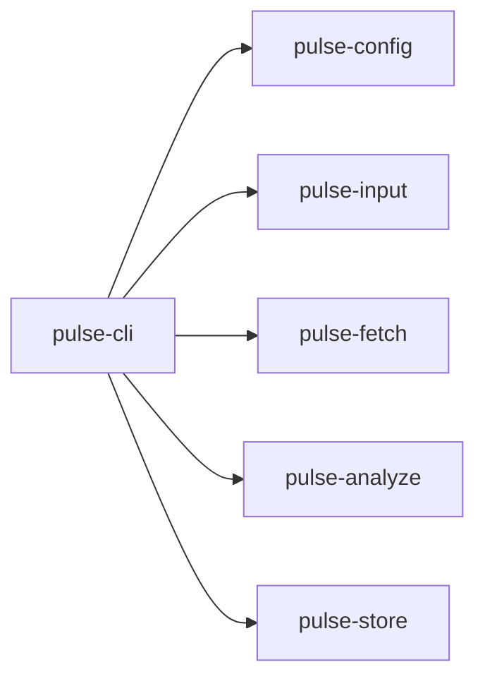
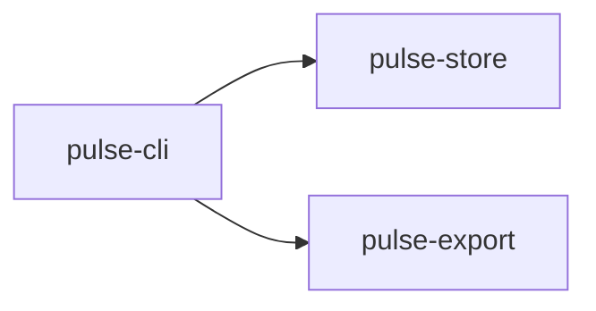

# Repository Layout

This document explains how the repository is organized and how the main folders map to the product architecture.

Read this after:

- [../../README.md](../../README.md)
- [../user-manual.md](../user-manual.md)
- [pipeline-overview.md](./pipeline-overview.md)

## 1. Top-Level Map

At a high level, the repository contains four kinds of things:

- product definition
- implementation
- reference documentation
- experiments and examples

## 2. Root Files And Folders

| Path | Purpose |
| --- | --- |
| `README.md` | project overview and beginner-friendly quick start |
| `m.md` | master navigation map |
| `spec.md` | long-term product specification |
| `commands.md` | intended CLI contract |
| `crates/` | production Rust workspace |
| `docs/` | user and implementation documentation |
| `examples/` | worked end-to-end example runs |
| `fixtures/` | sample inputs used by docs and tests |
| `spikes/` | experiments, prototypes, and investigations |
| `.specs/adr/` | architecture decision records |

## 3. The Rust Workspace

The `crates/` directory is where the production implementation lives.

Each crate owns a clear responsibility in the current architecture.

### `pulse-cli`

This is the top-level entrypoint.

Responsibilities:

- parse command-line arguments
- orchestrate `list`, `run`, and `report`
- connect all the lower-level crates into one operator workflow

### `pulse-core`

This is the shared domain layer.

Responsibilities:

- shared types
- state layout description
- result and model structures used across crates

When in doubt about a central type, start here.

### `pulse-config`

This crate loads YAML configuration.

Responsibilities:

- parse the YAML structure
- resolve config-relative paths
- expose structured config to the CLI

### `pulse-input`

This crate turns user input into normalized repository targets.

Responsibilities:

- parse CSV input
- normalize repository identifiers
- merge repository metadata such as teams and owner levels
- deduplicate targets

### `pulse-fetch`

This crate handles repository fetching.

Responsibilities:

- clone missing repositories
- fetch updates into managed local mirrors
- expose helper operations on fetched repos

### `pulse-git`

This crate is the lower-level Git helper layer.

Responsibilities:

- shared Git-related helpers
- internal support for fetch and history operations

### `pulse-analyze`

This crate computes snapshot facts.

Responsibilities:

- file inventory analysis
- repository-level totals
- focus classification
- per-file metrics such as bytes, lines, and language guess

### `pulse-store`

This crate is the persistence backbone.

Responsibilities:

- SQLite schema initialization
- stage checkpoints
- repository snapshot storage
- weekly history storage
- report dataset assembly

If you want to know what `pulse` remembers between runs, this crate is central.

### `pulse-export`

This crate turns stored state into exportable artifacts.

Responsibilities:

- CSV export
- JSON serialization helpers
- self-contained HTML report rendering

## 4. How A Request Flows Through The Code

The easiest way to understand the layout is to trace a `pulse run`.

And a `pulse report`:

## 5. Documentation And Reference Material

The repository keeps product and implementation references close to the code.

### `docs/`

Use this for:

- user guidance
- architecture walkthroughs
- state and schema references

### `examples/`

Use this when you want:

- a real worked run
- example inputs
- example output layout
- concrete artifacts to inspect

### `spikes/`

Use this when you want:

- experimental code
- benchmarks
- technical investigation notes

Spike code is not automatically production code.

### `.specs/adr/`

Use this when you want:

- durable architecture decisions
- historical rationale for a design choice

## 6. How To Navigate As A New Contributor

If you are trying to make a change, use this order:

1. read [../../README.md](../../README.md)
2. read [../../spec.md](../../spec.md)
3. read [../../commands.md](../../commands.md)
4. read the relevant `docs/` page
5. inspect the relevant crate in `crates/`

## 7. Which File To Open First

Use this table when you have a concrete question.

| Question | Best first file |
| --- | --- |
| What is this project trying to become? | `spec.md` |
| How is the CLI supposed to behave? | `commands.md` |
| How do I run it? | `docs/user-manual.md` |
| What is stored in the state directory? | `docs/state-layout/README.md` |
| What is in SQLite? | `docs/schemas/state-tables.md` |
| Where does input normalization happen? | `crates/pulse-input/src/lib.rs` |
| Where does persistence happen? | `crates/pulse-store/src/lib.rs` |
| Where is the HTML report built? | `crates/pulse-export/src/lib.rs` |

## 8. Related Documents

- [pipeline-overview.md](./pipeline-overview.md)
- [../state-layout/README.md](../state-layout/README.md)
- [../schemas/state-tables.md](../schemas/state-tables.md)
- [../../examples/README.md](../../examples/README.md)
