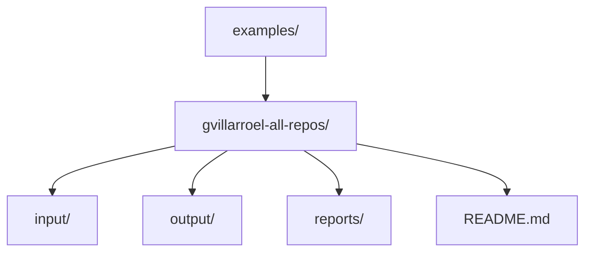

# Examples

This folder contains worked examples that show how `pulse` is actually used, not just how it is intended to be used.

Each example should contain:

- its own `README.md`
- the input files used for the run
- the output location used for the run
- any derived summaries that make the result easier to inspect

## Available Examples

- [gvillarroel-all-repos](/Users/villa/dev/pulse/examples/gvillarroel-all-repos/README.md): process all repositories visible under the GitHub user `gvillarroel`

## Example Layout

