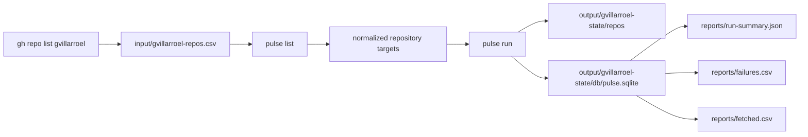

# Example: Process All Repositories Under `gvillarroel`

This example documents the full exercise of discovering, normalizing, fetching, and analyzing all repositories visible under the GitHub user `gvillarroel`.

It is a worked example, not just a template. The files in this folder are the actual artifacts produced during the run, except for the raw mirrored repository caches under `output/*/repos/`, which are intentionally excluded from Git because they are bulky and fully reproducible.

## Goal

Process all repositories under the GitHub user `gvillarroel` and persist reusable analysis state for later inspection.

## Folder Contents

- [input/gvillarroel-repos.csv](/Users/villa/dev/pulse/examples/gvillarroel-all-repos/input/gvillarroel-repos.csv): repository list generated from GitHub
- [input/ai-docs-focus.yaml](/Users/villa/dev/pulse/examples/gvillarroel-all-repos/input/ai-docs-focus.yaml): config used to prioritize AI-oriented markdown conventions such as `AGENTS.md`, `SKILL.md`, `skills.md`, and related files
- [input/ai-docs-owner-focus.yaml](/Users/villa/dev/pulse/examples/gvillarroel-all-repos/input/ai-docs-owner-focus.yaml): config that enables hierarchical owner grouping in the final report
- [output/gvillarroel-state](/Users/villa/dev/pulse/examples/gvillarroel-all-repos/output/gvillarroel-state): persisted state directory used by `pulse run`, with the raw `repos/` mirror cache omitted from version control
- [reports/run-summary.json](/Users/villa/dev/pulse/examples/gvillarroel-all-repos/reports/run-summary.json): compact machine-readable run summary
- [reports/failures.csv](/Users/villa/dev/pulse/examples/gvillarroel-all-repos/reports/failures.csv): failed repositories and error details
- [reports/fetched.csv](/Users/villa/dev/pulse/examples/gvillarroel-all-repos/reports/fetched.csv): successfully fetched repositories and revisions
- [output/gvillarroel-state/exports/report.html](/Users/villa/dev/pulse/examples/gvillarroel-all-repos/output/gvillarroel-state/exports/report.html): self-contained interactive HTML report generated from the persisted state

## Step By Step

### 1. Generate the repository list

The repository list was generated with GitHub CLI:

```powershell
gh repo list gvillarroel --limit 200 --json nameWithOwner
```

Then converted into a CSV with the `repo` column expected by `pulse`:

```powershell
@('repo') + ((gh repo list gvillarroel --limit 200 --json nameWithOwner | ConvertFrom-Json).nameWithOwner) | Set-Content examples\gvillarroel-all-repos\input\gvillarroel-repos.csv
```

### 2. Validate the normalized targets

Before running analysis, the list was validated with:

```powershell
cargo run -p pulse-cli -- list --input .\examples\gvillarroel-all-repos\input\gvillarroel-repos.csv --format json
```

### 3. Run the full processing pipeline

The processing run used this command:

```powershell
cargo run -p pulse-cli -- run --config .\examples\gvillarroel-all-repos\input\ai-docs-focus.yaml --state-dir .\examples\gvillarroel-all-repos\output\gvillarroel-state --progress --json
```

### 4. Extract a compact report from SQLite

After the run, summary artifacts were extracted from the SQLite database and stored under `reports/`.

### 5. Generate the interactive HTML report

The persisted state can also be turned into a single-file interactive report:

```powershell
cargo run -p pulse-cli -- report --state-dir .\examples\gvillarroel-all-repos\output\gvillarroel-state
```

This report is intentionally centered on AI-oriented markdown adoption:

- which repositories use conventions such as `AGENTS.md`, `SKILL.md`, `skills.md`, and `copilot-instructions.md`
- which linked markdown structures appear under those entrypoints
- when those conventions first appeared across the repository set

The owner-focused variant of the example also demonstrates multi-level owner metadata persisted into SQLite and switchable in the report as `Domain`, `Portfolio`, `Team`, and `Account`.

## Where Outputs Live

The durable outputs for this example are intentionally kept inside the example folder:

```text
examples/
  gvillarroel-all-repos/
    input/
      gvillarroel-repos.csv
    output/
      gvillarroel-state/
        repos/
        db/pulse.sqlite
        runs/
        logs/
        exports/
          report.html
    reports/
      run-summary.json
      failures.csv
      fetched.csv
```

This keeps the example inspectable and reproducible without committing large raw Git mirrors.

## Execution Flow



## Results

Run summary:

- repositories discovered: `44`
- repositories fetched: `43`
- repository snapshots persisted: `39`
- file snapshots persisted: `18545`
- weekly evolution rows persisted: `206`
- failed repositories: `5`

The summary source is [reports/run-summary.json](/Users/villa/dev/pulse/examples/gvillarroel-all-repos/reports/run-summary.json).

## Failures Observed

The following repositories failed in this run:

- `gvillarroel/https-gitlab.com-graphviz-graphviz`
- `gvillarroel/keras-retinanet`
- `gvillarroel/project-ai`
- `gvillarroel/python_euler`
- `gvillarroel/synthetic-data-for-text`

The detailed failure reasons are recorded in [reports/failures.csv](/Users/villa/dev/pulse/examples/gvillarroel-all-repos/reports/failures.csv).

## How To Reuse This Example

You can rerun the same example with the same state directory:

```powershell
cargo run -p pulse-cli -- run --config .\examples\gvillarroel-all-repos\input\ai-docs-focus.yaml --state-dir .\examples\gvillarroel-all-repos\output\gvillarroel-state --progress --json
```

Or use it as a template for another GitHub user by copying the folder structure and replacing the CSV input.

## Follow-On Work

The most useful next step after this example is to harden the analyzer against the five failed repository cases and rerun only the failed targets.
