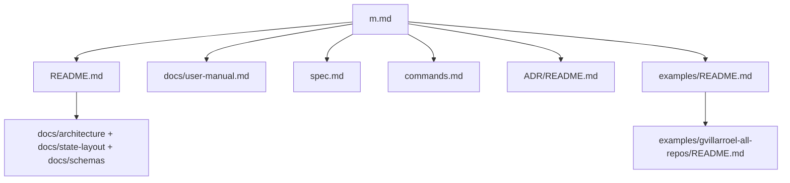

# Master Map

This is the top-level navigation document for the repository.

If you need to recover context quickly, start here and follow the links outward.

## What To Read First

- [README.md](/Users/villa/dev/pulse/README.md): repository overview and quick start
- [docs/user-manual.md](/Users/villa/dev/pulse/docs/user-manual.md): practical user guide
- [spec.md](/Users/villa/dev/pulse/spec.md): product and pipeline specification
- [commands.md](/Users/villa/dev/pulse/commands.md): CLI contract

## Architecture And Decisions

- [ADR/README.md](/Users/villa/dev/pulse/ADR/README.md): ADR index
- [docs/architecture/repository-layout.md](/Users/villa/dev/pulse/docs/architecture/repository-layout.md): production layout
- [docs/state-layout/README.md](/Users/villa/dev/pulse/docs/state-layout/README.md): operator state layout
- [docs/schemas/state-tables.md](/Users/villa/dev/pulse/docs/schemas/state-tables.md): SQLite table reference

## Examples

- [examples/README.md](/Users/villa/dev/pulse/examples/README.md): examples index
- [examples/gvillarroel-all-repos/README.md](/Users/villa/dev/pulse/examples/gvillarroel-all-repos/README.md): complete worked example for processing all repositories under `gvillarroel`

## Research And Spikes

- [spikes/](/Users/villa/dev/pulse/spikes): spike inventory and benchmark notes

## Navigation Diagram

